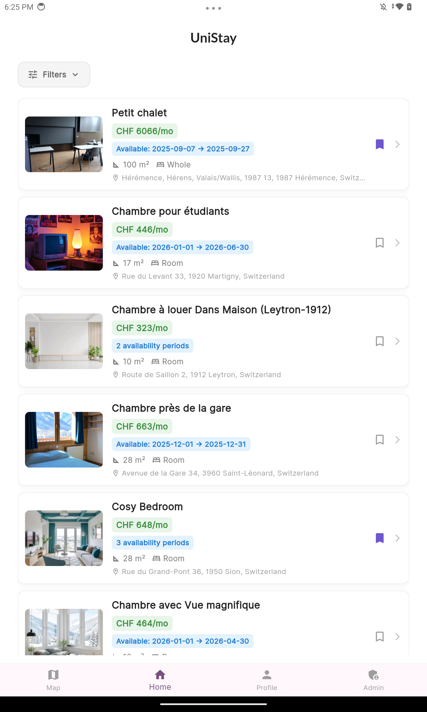

# UniStay – Student Housing App (Switzerland)

UniStay is a Flutter-based application designed to help students in Switzerland find housing easily.  
It provides separate interfaces for students (to book properties) and landlords (to list properties).

---

## 🌟 Features

- **User Registration & Login**
  - Student accounts
  - Landlord accounts
  - Face authentication

- **Search & Booking**
  - Search for available housing
  - Book properties
  - View property locations on map

- **Landlord Management**
  - Create, update, and delete property listings
  - Manage bookings

- **Additional Features**
  - Price prediction for properties
  - Multiplatform support

> ⚠️ Note: Payment system is not included in this project.

---

## 🛠️ Technologies

- **Frontend:** Flutter (Dart)
- **Backend:** Firebase (Authentication, Firestore, Storage)
- **Database:** Firestore (NoSQL)
- **External APIs:** Face reconition, Map services

---

## 💻 Installation

### From Source (Flutter) – For Development Only

> ⚠️ Note: Firebase services (auth, database, storage) will not work with the cloned repository unless you configure your own Firebase project.  
> The following steps are meant for developers who want to run and modify the app locally.

1. Make sure you have Flutter installed.
2. Clone the repository:
   ```bash
   git clone https://github.com/Algath/SS2-UniStay.git
   cd SS2-UniStay
   ```
3. ```bash
   flutter pub get
   ```
4. ```bash
   flutter run
   ```
   Can be run on Android device/emulator.

### Using the App (Internal Testing)
- Available via Google Play internal testing.
- Testers need to be registered via their Google account in the testing group
- This is the only way to access live data and fully functional features.

## 📂 Project Structure
Inside the `lib/` folder:
- `views/` → Main UI screens (Login, Register, Home, Property Details, Booking)
- `widgets/` → Reusable UI components
- `models/` → Data models (User, Property, Reservation)
- `services/` → Firebase interactions (AuthService, DatabaseService, StorageService)$
- `viewmodels` → ???

## 🔐 Authentication
- Managed via Firebase Authentication
- Supports student and landlord accounts
- Face authentication fully implemented and functional
  - Note: it work only for account where the profil picture was saved on the device

## 🗄️ Database (Firestore)
Main collections:
- users → student & landlord profiles
- rooms → property listings
- booking_requests → reservations linked to users & properties
- property_ratings → ratings information on the properties
- reviews → reviews on the properties (who, rating, comment, which property)
- student_reviews → reviews on the students (who, rating, comment, which student)

## 🖼️ Media Storage
- Property images stored in Firebase Storage
- Image URLs referenced in Firestore

## 📡 APIs & Services
- Firebase services (auth, Firestore, storage)
- External API for face reconition
- Map integration
- Nominatim for address recovery
- Open-Meteo to have weather
- OSRM (Open Source Routing Machine) to find public transport options

## 🎯 Target Users
- Students seeking accommodation in Switzerland
- Property owners looking to rent to students

## 📄 Known Limitations
- No payment system
- Only internal testing on Google Play
- Fully tested only on Android

## 🎥 Demonstration
- 1-minute overview video (UI + main flows)
- 5-minute detailed video (walkthrough of features)

## 🖼️ Screenshots
Here are a few key screens from UniStay:
### Login Screen


### Home / Search Page


### Student Profile


## 📝 Guides
- [User Guide](USER_GUIDE.md)
- [Technical Guide](TECH_GUIDE.md)