# UniStay User Guide

> App not publicly available, only for registered testers.

## 📑 Table of Contents

1. [Getting Started](#1-getting-started)  
   - [Installation](#11-installation)  
   - [Account Setup](#12-account-setup)  
2. [Logging In](#2-logging-in)  
3. [Searching for Accommodations](#3-searching-for-accommodations)  
   - [Browsing Properties](#31-browsing-properties)  
   - [Applying Filters](#32-applying-filters)  
   - [Map View](#33-map-view)  
4. [Viewing Property Details](#4-viewing-property-details)  
5. [Booking a Stay](#5-booking-a-stay)  
6. [Managing Your Bookings](#6-managing-your-bookings)  
7. [Hosting Your Property](#7-hosting-your-property-homeowner-profile-only)  
   - [Create a New Property](#71-create-a-new-property)  
   - [Manage Requests](#72-manage-requests)  
8. [Leaving a Review](#8-leaving-a-review)  
9. [Profile & Settings](#9-profile--settings)  
10. [Troubleshooting & FAQs](#10-troubleshooting--faqs)

## Welcome to UniStay

UniStay is a cross-platform mobile application that connects students with hosts offering accommodations around Switzerland. Whether you’re planning a weekend getaway or an extended stay, UniStay streamlines finding, booking, and managing your stays with security and ease.

> A payment system is not implemented in this app.

---

## Feature Overview

| Feature             | Description                                                  |
|---------------------|--------------------------------------------------------------|
| Search & Filters    | Discover listings by date, price, and amenities              |
| Map Search          | Find accommodation close to your university                  |
| Booking             | Reserve listings when enabled by the host who will confirm   |
| Reviews & Ratings   | Read and leave feedback to build community trust             |
| Calendar Management | Sync stays and manage availability in one place              |

---

## 1. Getting Started

### 1.1 Installation

1. Open the Google Play Store on your Android device.  
2. Search for **UniStay** and tap **Install**.  
3. Once installed, launch the app to begin.

### 1.2 Account Setup

1. Tap **Sign Up** on the welcome screen.  
2. Enter your email and choose a secure password.  
3. Choose your account type: **Student** or **Homeowner**.

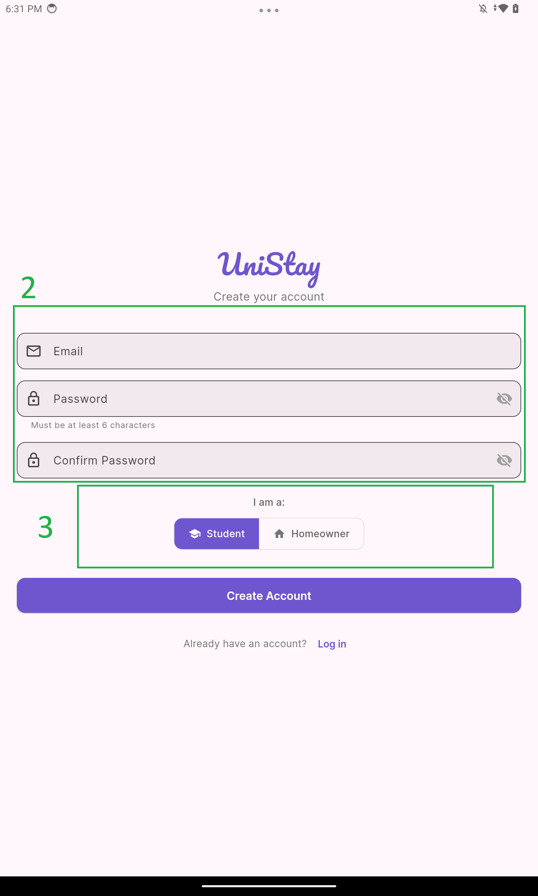

4. Provide your name, profile photo, and contact details.  
5. Validate your information to complete registration.

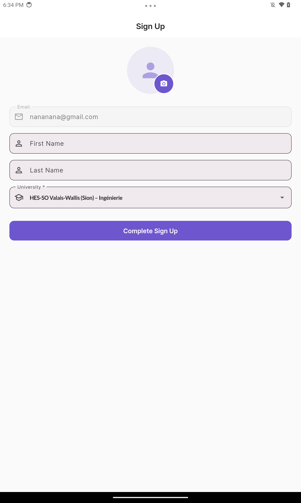

---

## 2. Logging In

### 2.1 Email & Password

- Enter your registered email and password. 
- Tap **Log In** to access the main page.

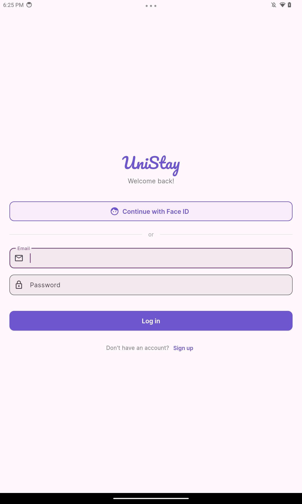

### 2.2 Face Authentication

> Face Authentication works only on the device where you enrolled your face.

1. On the login screen, select **Continue with Face ID**.  
2. Follow the prompts to scan your face in good lighting.  
3. Ensure your face is alone and fully visible in the frame.  
4. If recognition fails, you can retry or switch back to email login.

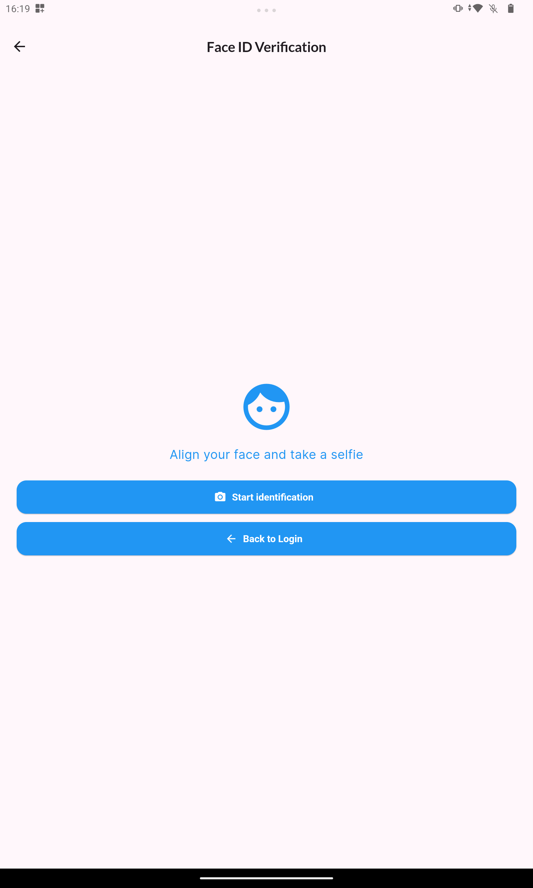

---

## 3. Searching for Accommodations

### 3.1 Browsing Properties

- From the home page, scroll through the latest available properties.  
- Tap any card to open full details.

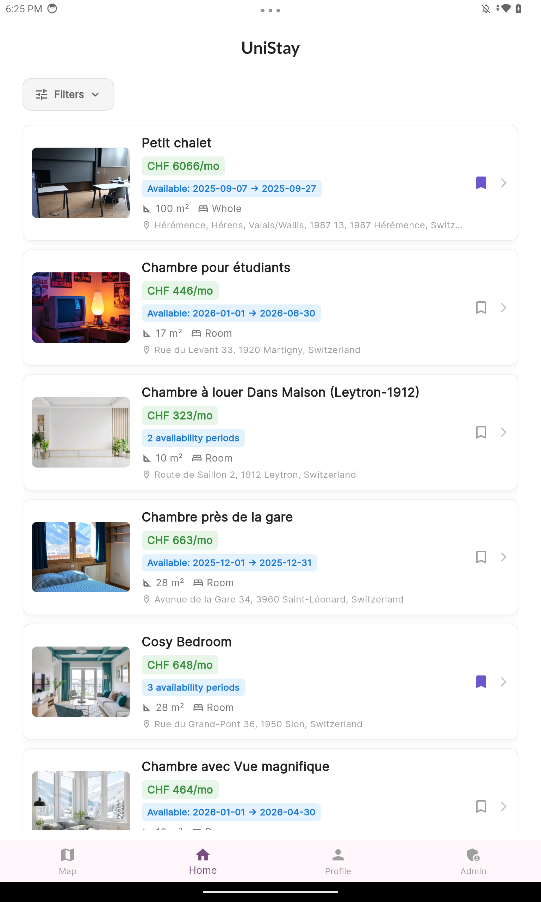

### 3.2 Applying Filters

1. Tap the **Filter** icon in the top-left corner.
2. Set your:
   - Date range  
   - Price min/max  
   - Room type (entire place or room only)  
   - Amenities (Wi-Fi, kitchen, parking, etc.)
3. Set your desired availability dates.  
4. Tap **Apply** to update the results.

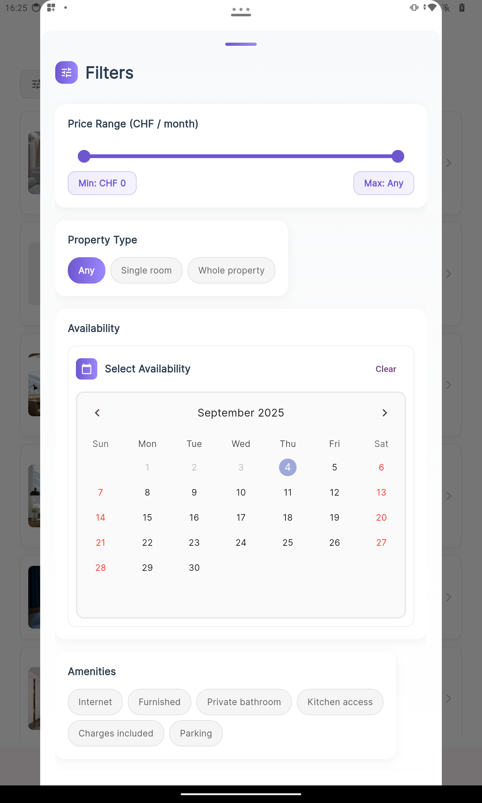

### 3.3 Map View

- Switch to **Map** mode via the bottom toggle.
- Select the university you want to find property around.
- Pinch to zoom and tap pins to preview listings.  
- Select a pin to jump to that property’s detail page.

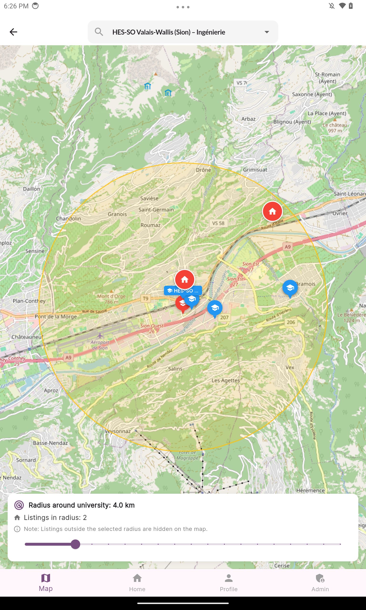

---

## 4. Viewing Property Details

- Tap any property card to open its details.
- Swipe through photos and read the full description.
- Compare the host’s asking price against our predicted market rate.
- View the property on the map.  
- Consult public transport options to reach your university.  
- Check availability, ratings, and past guest reviews.

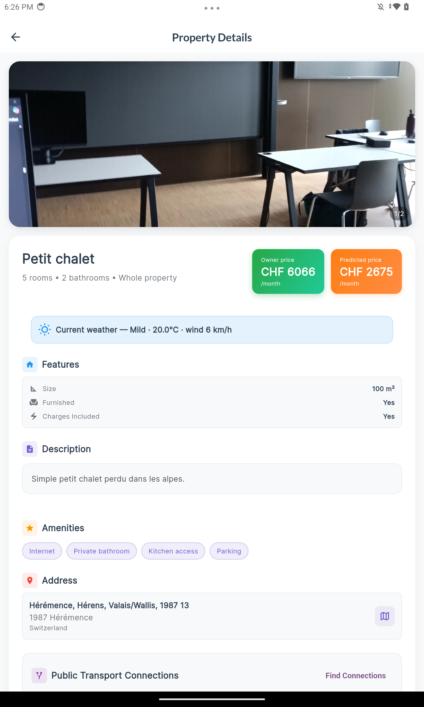

---

## 5. Booking a Stay

1. On a property page, pick your check-in and check-out dates.  
2. Tap **Book This Period** to send a booking request to the host.  
3. Once booked, you’ll see the propertie into your booking.

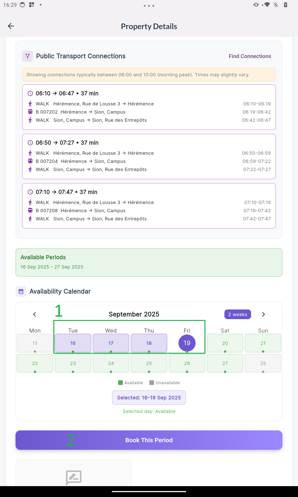

---

## 6. Managing Your Bookings

- Tap **Profile** in the bottom menu.  
- Under **Bookings**, view all your current and past reservations.  
- View all current and past reservations (Pending, Accepted, Refused, History).
- Tap any booking to see detailed info.

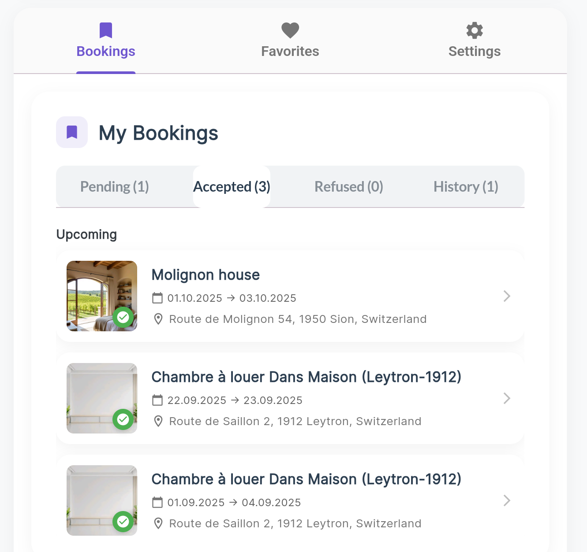

---

## 7. Hosting Your Property (Homeowner Profile only)

### 7.1 Create a New Property

1. Go to **Profile** and select the **Properties** tab.  
2. Tap **Add New Property**.  
3. Enter property details: title, description, photos, location, and pricing.  
5. Define availability on the integrated calendar. 
6. Review suggested price vs. your asking price.  
7. Confirm to make you property live.

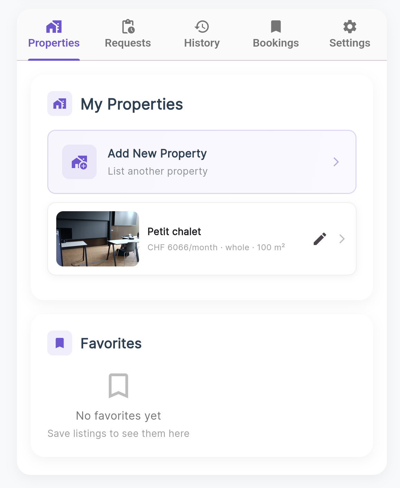

### 7.2 Manage Requests

- In **Profile → Requests**, see all incoming booking inquiries.  
- Review guest profiles and ratings.  
- Tap **Accept** or **Reject** to respond.

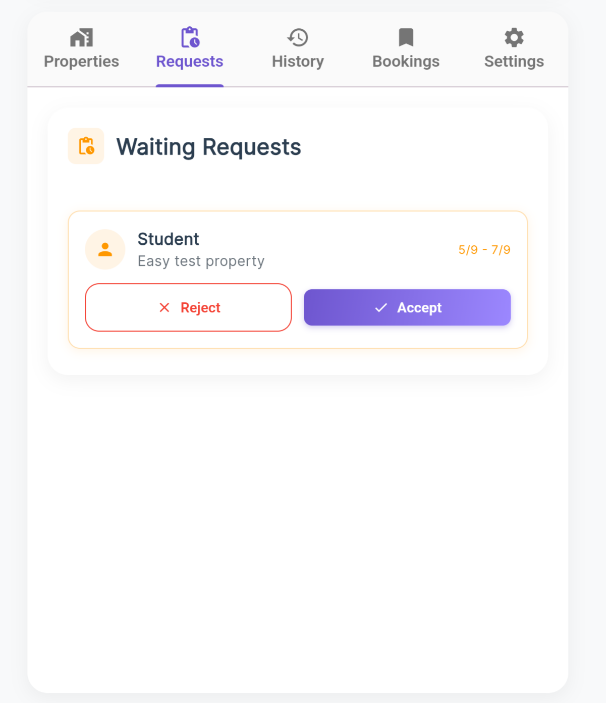

---

## 8. Leaving a Review

- After check-out, you can leave a review and rating.  
- Provide a star rating (1–5) and write a brief review.  
- Submit to help future users make informed decisions.

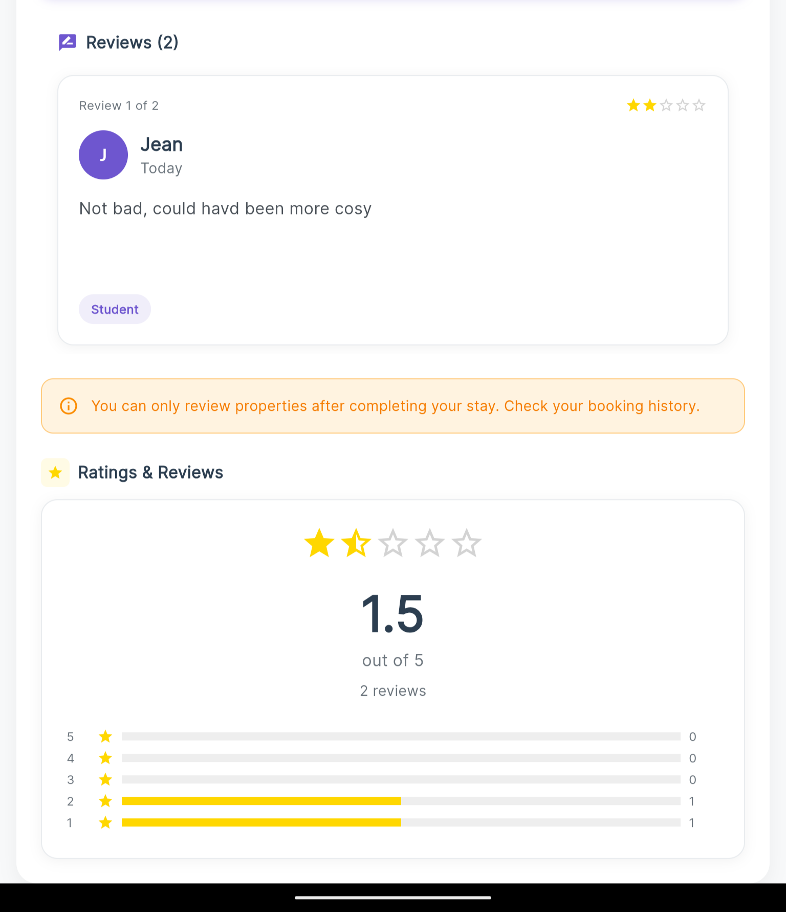

---

## 9. Profile & Settings

### 9.1 Edit Profile

- Tap **Profile → Edit Profile**.  
- Update your name, photo, university.  
- Tap **Save** to apply changes.

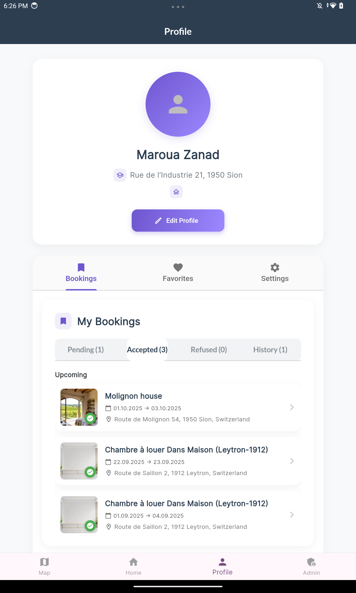

### 9.2 Settings

- From **Profile**, select **Settings**.  
- Access **About Us** for app information.  
- Tap **Log Out** to end your session.

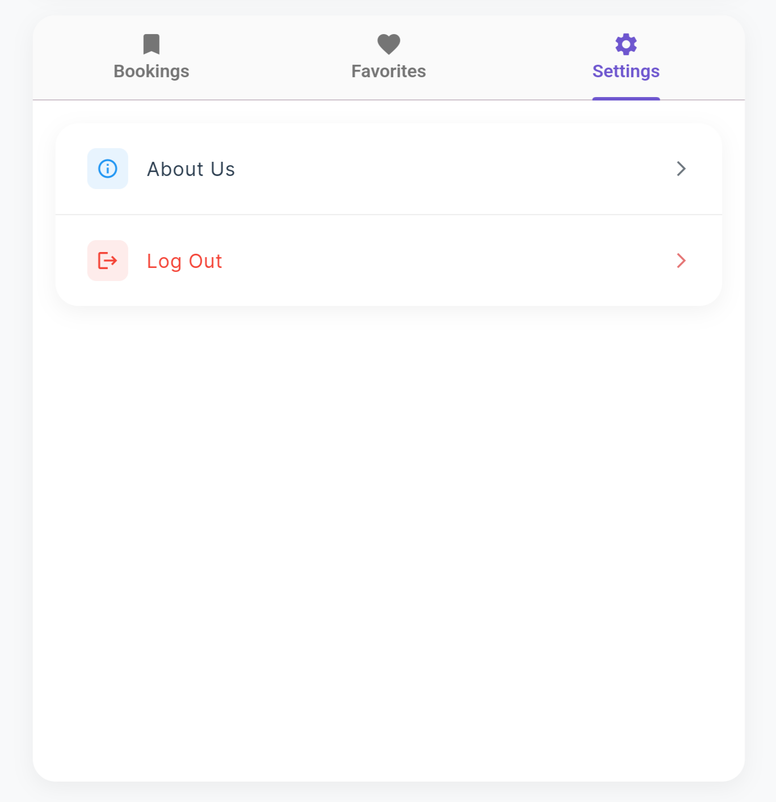

---

## 10. Troubleshooting & FAQs

- **Cannot Sign Up:** Ensure your email isn’t already registered. 
- **Face ID Fails:** 
    - Re-enroll your picture profile under **Profile → Edit Profile**.
    - You should be alone on the pictures to make it work.
- **Map Loads Slowly:** Check your internet connection and location permissions.  
- **Booking Stuck on Pending:** Wait for the host’s response; you will see it as an in-app change.
- **Still Need Help?** Sorry we currently do not have a support.

---

Thank you for using UniStay. We hope this guide helps you every step of the way, from finding your stay to welcoming guests.
